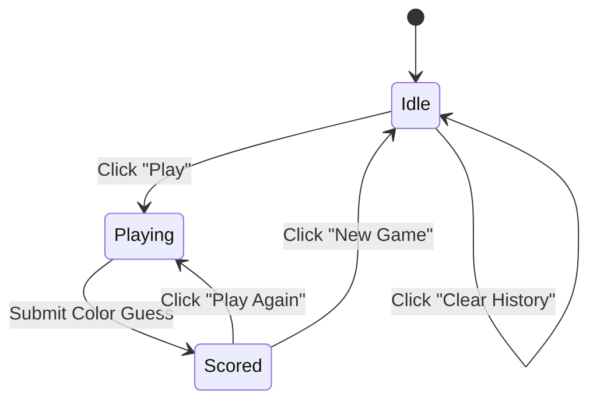
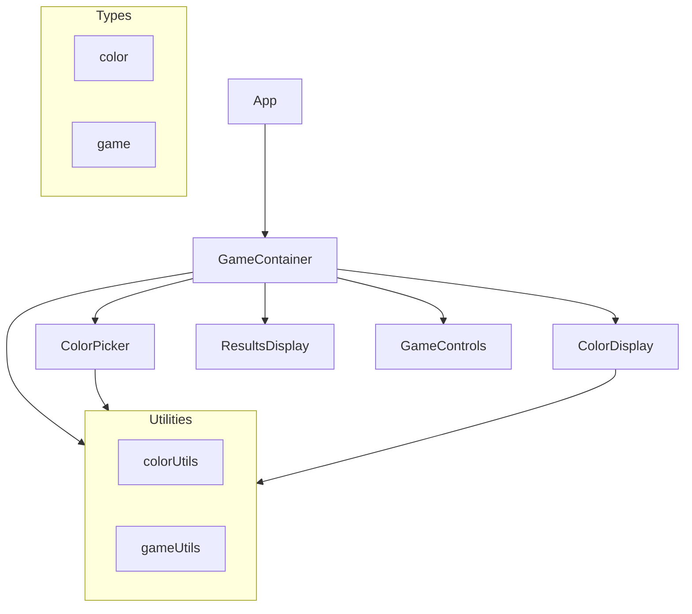

# Color Chain Game - Implementation Plan

## Game Overview

**Name:** Color Chain  
**Objective:** Guess the exact middle color between two random colors  
**Scoring:** 1000 points for perfect score, with points decreasing based on color distance

## Game Flow



## Component Architecture



## Game States

| State | Description | UI Elements |
|-------|-------------|-------------|
| `idle` | Game not started, waiting to play | "Play" button, history display |
| `playing` | User is selecting their color guess | Color picker active, "Submit" button |
| `scored` | Round completed, showing results | Score display, "Play Again" and "New Game" buttons |

## Scoring Algorithm

The score is calculated based on the Euclidean distance between the user's guess and the actual middle color in RGB space:

```
distance = sqrt((r1-r2)² + (g1-g2)² + (b1-b2)²)
max_distance = sqrt(255² + 255² + 255²) ≈ 441.67
score = max(0, 1000 * (1 - distance / max_distance))
```

## Component Specifications

### 1. ColorPicker Component

**Purpose:** Allow users to select a color by clicking on a 2D gradient

**Features:**
- Large color gradient canvas (HSL color space for better UX)
- Click anywhere to select color
- Visual indicator of selected position
- Preview of selected color
- Support for both mouse and touch

**Props:**
```typescript
interface ColorPickerProps {
  onColorSelect: (color: Color) => void;
  disabled?: boolean;
}
```

**Implementation Details:**
- Use HSL color space for the gradient (Hue on x-axis, Saturation on y-axis)
- Lightness slider for fine-tuning
- Convert HSL to RGB for the game logic

### 2. ColorDisplay Component

**Purpose:** Display the game colors and results

**Features:**
- Show two endpoint colors (left and right)
- Display gradient line between them
- After guess: show target middle color
- After guess: show user's guess
- Visual comparison with color difference indicator

**Props:**
```typescript
interface ColorDisplayProps {
  colorA: Color;
  colorB: Color;
  gameState: 'idle' | 'playing' | 'scored';
  targetColor?: Color;
  guessColor?: Color;
}
```

### 3. ResultsDisplay Component

**Purpose:** Display scores and game history

**Features:**
- Current round score
- Best score
- Total score
- Round history list
- Clear history button

**Props:**
```typescript
interface ResultsDisplayProps {
  currentScore: number;
  bestScore: number;
  totalScore: number;
  history: RoundResult[];
  onClearHistory: () => void;
}
```

### 4. GameContainer Component

**Purpose:** Main game logic and state management

**State:**
```typescript
interface GameState {
  status: 'idle' | 'playing' | 'scored';
  colorA: Color;
  colorB: Color;
  targetColor: Color;
  guessColor: Color | null;
  currentScore: number;
  bestScore: number;
  totalScore: number;
  history: RoundResult[];
}

interface RoundResult {
  colorA: Color;
  colorB: Color;
  targetColor: Color;
  guessColor: Color;
  score: number;
  timestamp: Date;
}
```

**Features:**
- Generate random colors
- Calculate middle color
- Handle color selection
- Calculate score
- Manage game history
- Control game flow

## Utility Functions

### Color Utilities (src/utils/colorUtils.ts)

```typescript
// Already exists:
- calcMiddleColor(colorA: Color, colorB: Color): Color

// To add:
- generateRandomColor(): Color
- rgbToHex(color: Color): string
- rgbToCss(color: Color): string
- hexToRgb(hex: string): Color
- hslToRgb(h, s, l): Color
- rgbToHsl(color: Color): { h, s, l }
- calculateColorDistance(color1: Color, color2: Color): number
- calculateScore(guess: Color, target: Color): number
```

## UI/UX Design

### Layout
- Header with game title
- Main game area with:
  - Color display (top)
  - Color picker (center, large)
  - Controls (bottom)
- Results/history panel (side or bottom)

### Animated Background (Idle State)
- **Purpose:** Create an engaging visual experience while waiting to play
- **Implementation:** CSS gradient animation with smooth color transitions
- **Behavior:**
  - Active only during idle state
  - Fades out when game starts (playing/scored states)
  - Smooth transition between states

**Animation Details:**
```css
@keyframes colorShift {
  0% { background-position: 0% 50%; }
  50% { background-position: 100% 50%; }
  100% { background-position: 0% 50%; }
}

.animated-background {
  background: linear-gradient(-45deg, #ee7752, #e73c7e, #23a6d5, #23d5ab);
  background-size: 400% 400%;
  animation: colorShift 15s ease infinite;
}
```

### Color Picker Design
- 2D gradient using HSL color space
- X-axis: Hue (0-360)
- Y-axis: Saturation (0-100%)
- Lightness: Separate slider (50% default)
- Click indicator showing selected position

### Buttons
- Primary: "Play" / "Submit" / "Play Again"
- Secondary: "New Game" / "Clear History"
- Disabled states for inactive buttons

### Responsive Design
- Mobile: Stacked layout
- Tablet: Side-by-side layout
- Desktop: Full-width color picker with side panel

## File Structure

```
src/
├── components/
│   ├── ColorDisplay.tsx          # Display game colors
│   ├── ColorPicker.tsx           # 2D color gradient picker
│   ├── GameContainer.tsx         # Main game logic
│   ├── ResultsDisplay.tsx        # Score and history
│   └── GameControls.tsx          # Button controls (new)
├── types/
│   ├── color.ts                  # Color types (exists)
│   └── game.ts                   # Game state types (new)
├── utils/
│   ├── colorUtils.ts             # Color utilities (extend)
│   └── gameUtils.ts              # Game-specific utilities (new)
├── App.tsx                       # Main app component
└── App.css                       # Game-specific styles
```

## Implementation Order

1. **Utilities First** - Add color utility functions
2. **Types** - Define game state types
3. **ColorPicker** - Build the 2D gradient interface
4. **ColorDisplay** - Update to show game colors
5. **ResultsDisplay** - Update to show scores
6. **GameContainer** - Implement main game logic
7. **GameControls** - Create button controls
8. **Animated Background** - Add CSS gradient animation for idle state
9. **Styling** - Add CSS for the game
10. **Testing** - Verify complete game flow

## Technical Considerations

### Color Space
- Use RGB for game calculations (existing utility)
- Use HSL for the color picker UI (better UX)
- Convert between formats as needed

### Performance
- Memoize color calculations
- Use React state efficiently
- Optimize re-renders

### Accessibility
- Keyboard navigation support
- ARIA labels for color elements
- High contrast for text

### Browser Compatibility
- Modern browsers (ES6+)
- Canvas API for color gradient
- Touch events for mobile

## Future Enhancements (Optional)

- Difficulty levels (color distance tolerance)
- Time limit per round
- Multiplayer mode
- Leaderboard
- Sound effects
- Animations for scoring
- Share results
